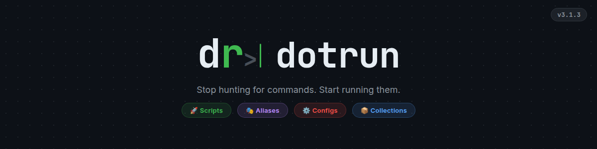
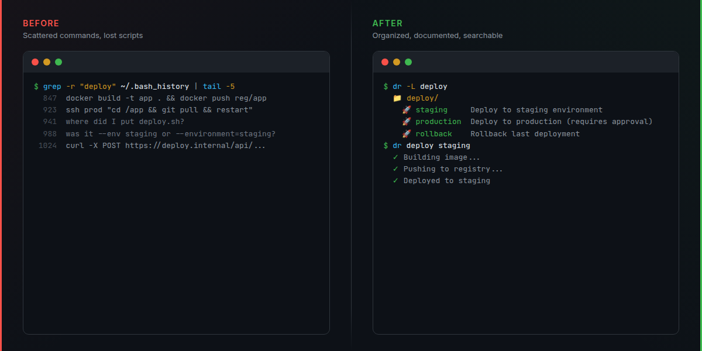
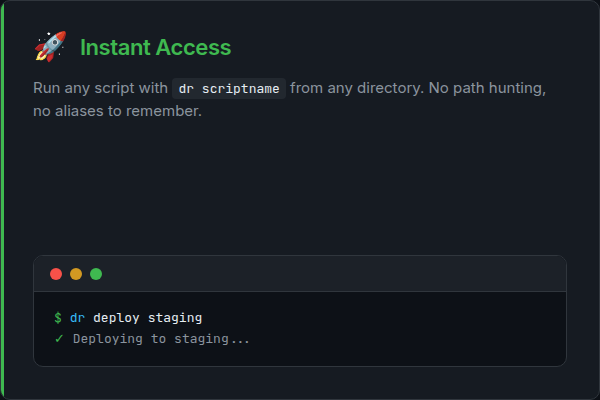
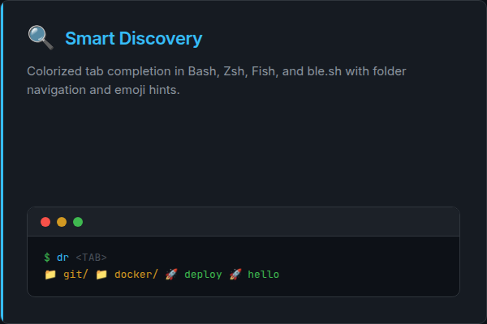
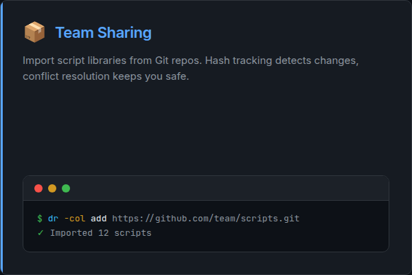
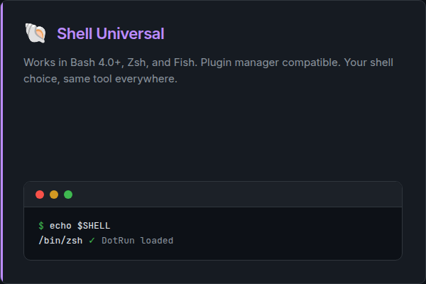
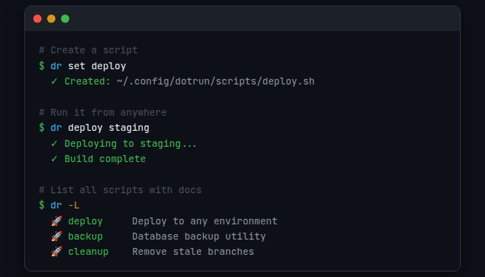
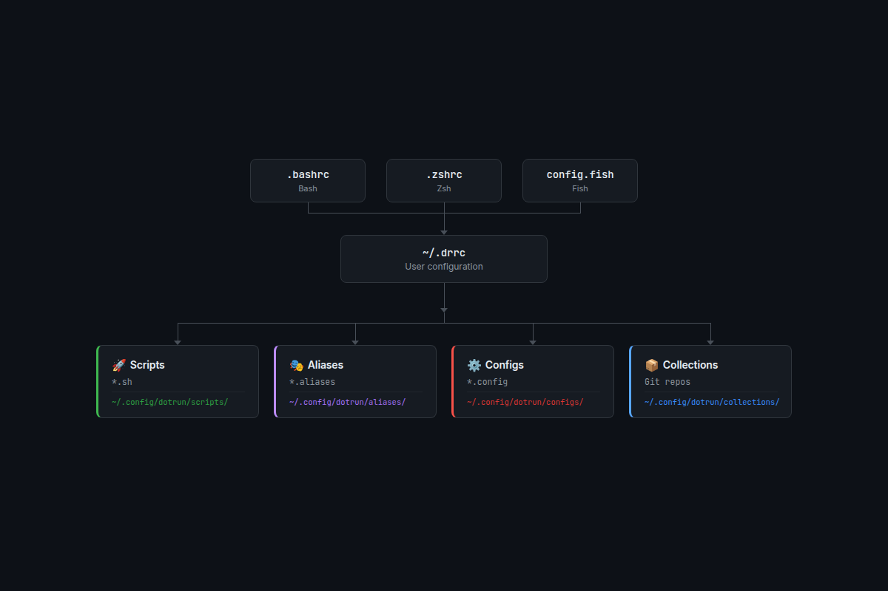

<p align="center">
  
</p>

<p align="center">
  <a href="VERSION"></a>
  <a href="LICENSE"></a>
  
</p>

DotRun transforms scattered scripts, complex command sequences, and tribal knowledge into a unified, searchable, and shareable toolkit that works across all your projects.

## The Problem

Developers waste countless hours on repetitive tasks:

- **Searching Slack** for that deployment command someone shared last month
- **Copy-pasting** complex Git workflows from documentation
- **Re-creating** environment setup scripts for each new project
- **Remembering** which parameters go with which tools

You know the solution exists somewhere, but finding and using it is the hard part.

## The Solution

DotRun gives you instant access to any script from anywhere:

```bash
# Instead of this complexity...
git fetch --all && git branch -vv | awk '/: gone]/{print $1}' | xargs git branch -d

# Just run this
dr git/cleanup
```

**One command replaces dozens of scattered scripts, aliases, and copy-paste workflows.**

## 30-Second Demo

Install and run your first script in 30 seconds:

```bash
# 1. Install DotRun
bash <(curl -fsSL https://raw.githubusercontent.com/jvPalma/dotrun/master/install.sh)

# 2. Create a script
dr set deploy

# 3. Run it from anywhere
cd ~/any-project && dr deploy
```

## Before vs After

<p align="center">
  
</p>

<details>
<summary>View as text (accessibility fallback)</summary>

**Before DotRun:**

```bash
# Deployment scattered across multiple places
grep -r "deploy" ~/.bash_history | tail -5
# Copy from Slack: docker build -t app . && docker push...
# Find that script: where did I put deploy.sh?
# Remember parameters: was it --env staging or --environment=staging?
```

**After DotRun:**

```bash
# Everything in one place, documented, and searchable
dr -L deploy      # List all deployment scripts
dr help deploy    # Show documentation
dr deploy staging # Run with confidence
```

</details>

## Why DotRun?

**vs Individual Scripts:** Unified access, automatic documentation, team sharing  
**vs Aliases:** Cross-shell support, parameter handling, self-documenting  
**vs Makefiles:** Project-independent, globally accessible, language-agnostic  
**vs README lists:** Executable, searchable, with built-in help

## Key Features

- **🚀 Instant Access** - Run any script with `dr scriptname` from anywhere
- **📚 Self-Documenting** - Every script includes usage examples and help text
- **👥 Team Sharing** - Import/export collections while keeping personal scripts separate
- **🔍 Smart Discovery** - Find scripts by name, category, or description with intelligent tab completion
- **🐚 Shell Universal** - Works in Bash, Zsh, and Fish with colorized completion
- **⚙️ File-Based Config** - Manage aliases and environment variables in organized files
- **🔄 Smart Updates** - Collection system tracks modifications and handles conflicts

<table>
  <tr>
    <td></td>
    <td></td>
  </tr>
  <tr>
    <td></td>
    <td></td>
  </tr>
</table>

## Quick Preview

<p align="center">
  
</p>

## Installation

```bash
bash <(curl -fsSL https://raw.githubusercontent.com/jvPalma/dotrun/master/install.sh)
```

Installs to `~/.local/bin/dr` with workspace in `~/.config/dotrun/`

## Quick Start

### Create Your First Script

```bash
dr set hello
# Opens editor with documentation template
# Add: echo "Hello from anywhere!"
dr hello # Run from any directory
```

### Organize with Namespaces

```bash
# Script management
dr -s set deploy # Create script (or: dr scripts set deploy)
dr -s list git/  # Browse by folder

# Alias management (file-based, multiple aliases per file)
dr -a set 01-git # Opens editor: ~/.config/dotrun/aliases/01-git.aliases
dr -a list       # View all alias files

# Config management (file-based, multiple exports per file)
dr -c set api/keys        # Opens editor: ~/.config/dotrun/configs/api/keys.config
dr -c list --category api # View configs by category
```

### Install Example Collections

```bash
# Install collection from GitHub
dr -col add https://github.com/jvPalma/dotrun.git
# Select which scripts/aliases/helpers to import

# Browse and run
dr -L          # List all scripts
dr git/cleanup # Run imported script

# Keep collections updated
dr -col sync          # Check for updates
dr -col update dotrun # Update with conflict resolution
```

### Install AI Agent Skill

```bash
# Install DotRun skill for Claude Code or other AI agents
npx skills add https://github.com/jvpalma/dotrun --skill dr-cli
```

This gives AI coding agents deep knowledge of DotRun's script system, enabling them to create, manage, and migrate scripts following best practices.

### Explore with Tab Completion

```bash
# Zsh: Colorized hierarchical navigation
dr <tab>                  # See folders (yellow), scripts (cyan), special commands (green)
dr git/<tab>              # Navigate into folders
dr -s <tab>               # Script commands (green)
dr -a <tab>               # Alias commands (purple)
dr -c <tab>               # Config commands (red)

# All shells support namespace commands
dr scripts set deploy     # Same as: dr -s set deploy
dr aliases set 01-git     # Opens alias file editor
dr config set api/keys    # Opens config file editor
```

## Core Workflow

1. **Create:** `dr set scriptname` - Creates or edits script with documentation template
2. **Document:** Add `### DOC` sections for usage examples and help
3. **Run:** `dr scriptname` - Execute from anywhere with tab completion
4. **Discover:** `dr -L` - Browse all scripts with descriptions
5. **Share:** Collections for team scripts, keep personal scripts separate

## Collections System

Share script libraries with your team while maintaining full control over updates and local modifications.

**Collections** are git repositories containing reusable scripts, aliases, helpers, and configs. When you install a collection, resources are copied to your local workspace with hash tracking for smart updates.

```bash
# Install collection
dr -col add https://github.com/user/dotrun-scripts.git

# Browse installed collections
dr -col list

# Check for updates
dr -col sync

# Update with conflict resolution
dr -col update my-collection
```

## Architecture

<p align="center">
  
</p>

## Documentation

**📚 [Complete Documentation](https://github.com/jvPalma/dotrun/wiki)**

| Guide                                                                                    | Description                           |
| ---------------------------------------------------------------------------------------- | ------------------------------------- |
| **[Installation](https://github.com/jvPalma/dotrun/wiki/Installation-Guide)**            | One-command setup for all platforms   |
| **[Quick Start](https://github.com/jvPalma/dotrun/wiki/Quick-Start-Tutorial)**           | Your first 5 minutes with DotRun      |
| **[Scripts](https://github.com/jvPalma/dotrun/wiki/Script-Management)**                  | Create, organize, and run scripts     |
| **[Collections](https://github.com/jvPalma/dotrun/wiki/Collection-Management-Advanced)** | Share script libraries with your team |
| **[FAQ](https://github.com/jvPalma/dotrun/wiki/FAQ)**                                    | Common questions and troubleshooting  |

### Quick Reference

| Feature         | Create/Edit         | List           | Run                   |
| --------------- | ------------------- | -------------- | --------------------- |
| **Scripts**     | `dr set name`       | `dr -L`        | `dr name`             |
| **Aliases**     | `dr -a name`        | `dr -a list`   | _(auto-loaded)_       |
| **Configs**     | `dr -c name`        | `dr -c list`   | _(auto-loaded)_       |
| **Collections** | `dr -col add <url>` | `dr -col list` | _(scripts available)_ |

## Requirements

- **OS:** Linux, macOS, Windows (WSL)
- **Shell:** Bash 4.0+, Zsh, or Fish
- **Dependencies:** Git (required), ShellCheck (optional), glow (optional)

## Get Started

```bash
# 1. Install
bash <(curl -fsSL https://raw.githubusercontent.com/jvPalma/dotrun/master/install.sh)

# 2. Verify (restart terminal first)
dr --version

# 3. Create your first script
dr set hello
# Add: echo "Hello from DotRun!"

# 4. Run it from anywhere
dr hello
```

**[Full Quick Start Tutorial](https://github.com/jvPalma/dotrun/wiki/Quick-Start-Tutorial)** | **[Browse all documentation](https://github.com/jvPalma/dotrun/wiki)**

---

**Transform your development workflow from scattered scripts to unified productivity.**

_Questions? [Open an issue](https://github.com/jvPalma/dotrun/issues) or check our [FAQ](https://github.com/jvPalma/dotrun/wiki/FAQ)_
